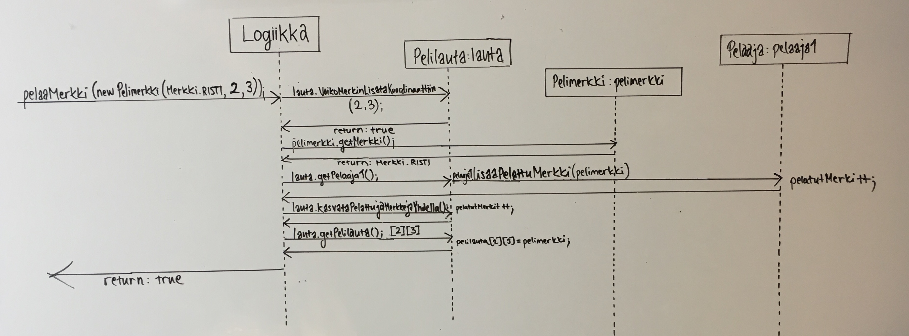
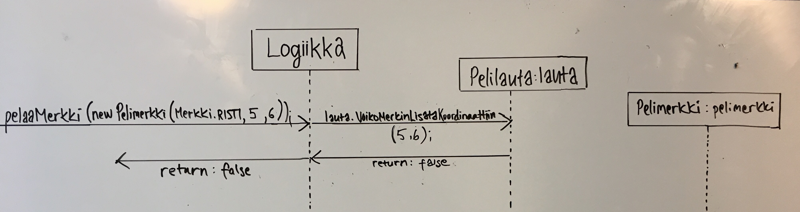
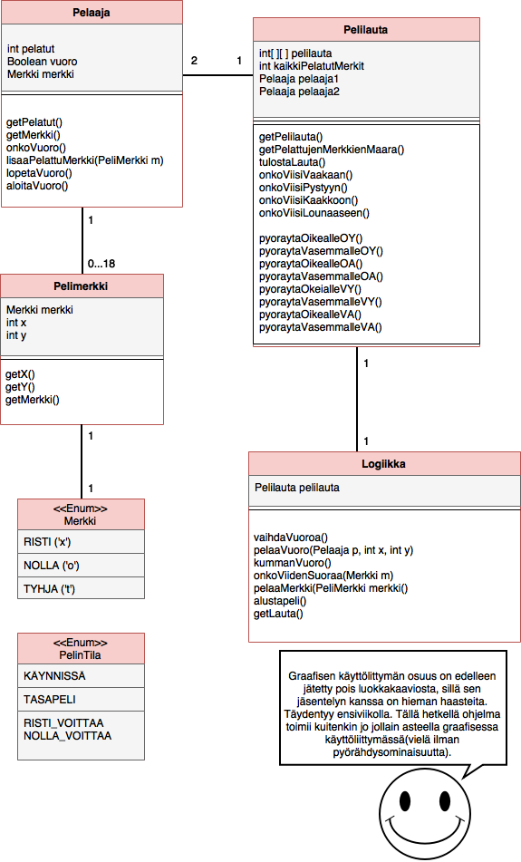

#ProRistinolla

##AIHE:

Toteutetaan eräänlainen ristinolla -peli kaksin pelattavaksi. Pelialustana toimii 6x6 kokoinen ruudukko, johon voittaakseen tulee saada viisi omaa merkkiä peräkkäin pystysuuntaan,$
        Jos tehtävä valmistuu ripeästi, on tarkoituksena laajentaa ohjelmaa siten, että pelialusta jaetaan neljään 3x3 ruutua kokoiseen palaan, jotka muodostavat pelialustan.

##KÄYTTÄJÄT:    Pelaaja 1 ja pelaaja 2

##PELAAJAN TOIMINNOT:

- Pelin luovuttaminen

 - onnistuu vain jos meneillään on pelaajan oma vuoro

- Pelaajan merkin asettaminen (vaihe 1)

   Merkin koordinaatit ovat laudalla ja ruudussa ei ole ennestään merkkiä

   Merkin koordinaatit ovat laudan ulkopuolella, eikä merkkiä näin ollen voida pelata

- Pelilaudan osan pyörittäminen (vaihe 2)

 - onnistuu vain jos pelaaja on asettanut jo merkin vuorollaan

- Vuoron päättäminen

 - onnistuu vain jos vuoron vaiheet on suoritettu

- Pelin lopettaminen

 - onnistuu, jos vastapelaaja on luovuttanut

 - tai onnistuu, jos toinen pelaajista saa 5 merkkiään peräkkäin

##KAIKKIEN KÄYTTÄJIEN TOIMINNOT:

- Pelin käynnistäminen

- Uuden pelin aloittaminen

 - onnistuu vain, jos edellinen peli on lopetettu

###LUOKKAKAAVIO

